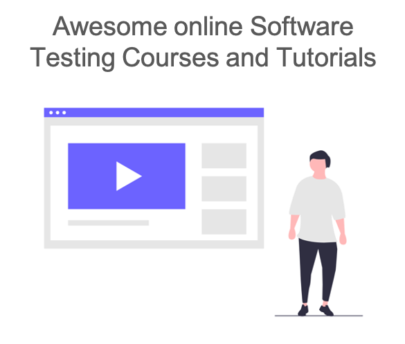

# Awesome Testing Courses & Tutorials    

> A curated list of awesome online courses & tutorials on software testing, test automation and more.

## Contents
* [Automation in Testing](#automation-in-testing)
* [Blazemeter University](#blazemeter-university)
* [Codecademy](#codecademy)
* [Cucumber School](#cucumber-school)
* [edX](#edx)
* [JetBrains Academy](#jetbrains-academy)
* [LinkedIn Learning](#linkedin-learning)
* [Ministry of Testing Dojo](#ministry-of-testing-dojo)
* [Oracle University](#oracle-university)
* [Pluralsight](#pluralsight)
* [Test Automation University from Applitools](#test-automation-university-from-applitools)

---

## Automation in Testing
**Free access** :free:
* [Programming Basics](https://automationintesting.com/programming/course/)
* [C Sharp Basics](https://automationintesting.com/csharp/course/)
* [Java Basics](https://automationintesting.com/java/course/)
* [JavaScript Basics](https://automationintesting.com/node/course/)
* [RestAssured](https://automationintesting.com/restassured/course/)
* [Selenium Java](https://automationintesting.com/selenium/java/course/)

---

## Blazemeter University

**Free access** free:

* [JMeter™ Intro](https://university.blazemeter.com/)
* [JMeter™ Pro](https://university.blazemeter.com/)
* [The Complete Taurus Course](https://university.blazemeter.com/)
* [Master BlazeMeter Performance Testing](https://university.blazemeter.com/)
* [BlazeMeter Infrastructure Management](https://university.blazemeter.com/)
* [Introduction to BlazeMeter Mock Services](https://university.blazemeter.com/)

---

## Codecademy

**Paid subscription** :moneybag:

### Testing Courses

* [Learn JavaScript Unit Testing](https://www.codecademy.com/learn/learn-javascript-unit-testing)
* [Learn Testing for Web Development](https://www.codecademy.com/learn/learn-testing-for-web-development)

---

## Cucumber School

**Free access** :free:

* [BDD with Cucumber (Java)](https://school.cucumber.io/courses/bdd-with-cucumber-java)
* [BDD with Cucumber (JavaScript)](https://school.cucumber.io/courses/bdd-with-cucumber-javascript)
* [BDD with Cucumber (Ruby)](https://school.cucumber.io/courses/bdd-with-cucumber-ruby)

---

## edX

**Free to audit** :free:, **verified certificate** :moneybag:

### Software Testing Courses

* [Methods and techniques to test and verify software, MicroMasters, 2020](https://www.edx.org/micromasters/usmx-umgc-software-testing-and-verification)
  * [Software Testing Fundamentals, 2020](https://www.edx.org/course/software-testing-fundamentals)
  * [Software Testing Management, 2020](https://www.edx.org/course/software-testing-management)
  * [Formal Software Verification, 2020](https://www.edx.org/course/formal-software-verification-2)
* [Automated Software Testing: Model and State-based Testing](https://www.edx.org/course/automated-software-testing-model-and-state-based-2)
* [Automated Software Testing: Unit Testing, Coverage Criteria and Design for Testability](https://www.edx.org/course/automated-software-testing-unit-testing-coverage-2)

---

## JetBrains Academy

**Free courses on programming** :free:

### Java

* [Java Track](https://hyperskill.org/onboarding/?track=java)

### Kotlin

* [Kotlin Track](https://hyperskill.org/onboarding/?track=kotlin)

### Python

* [Python Track](https://hyperskill.org/onboarding/?track=python)

---

## LinkedIn Learning

**Paid subscription** :moneybag:

### Learning Paths

* [Become a Software Tester](https://www.linkedin.com/learning/paths/become-a-software-tester)
* [Become a Test Automation Engineer](https://www.linkedin.com/learning/paths/become-a-test-automation-engineer)
* [Become an Ethical Hacker](https://www.linkedin.com/learning/paths/become-an-ethical-hacker)

### Software Testing

* [Programming Foundations: Software Testing/QA, 2019](https://www.linkedin.com/learning/programming-foundations-software-testing-qa)
* [Agile Testing, 2018](https://www.linkedin.com/learning/agile-testing-2)
* [Software Testing: Exploratory Testing, 2019](https://www.linkedin.com/learning/software-testing-exploratory-testing)
* [Software Testing: Tools, 2019](https://www.linkedin.com/learning/software-testing-tools)
* [Software Testing Foundations: Test Management, 2020](https://www.linkedin.com/learning/software-testing-foundations-test-management)
* [Software Testing Foundations: Test Planning, 2020](https://www.linkedin.com/learning/software-testing-foundations-test-planning)
* [Software Testing Tips Weekly](https://www.linkedin.com/learning/software-testing-tips-weekly)
* [Nail Your Software Tester Interview, 2020](https://www.linkedin.com/learning/nail-your-software-tester-interview)
* [Programming Foundations: Test-Driven Development, 2019](https://www.linkedin.com/learning/programming-foundations-test-driven-development-2)
* [UX Foundations: Usability Testing, 2015](https://www.linkedin.com/learning/ux-foundations-usability-testing)
* [Software Testing Foundations: Bug Writing and Management. 2020](https://www.linkedin.com/learning/software-testing-foundations-bug-writing-and-management)
* [Software Testing Foundations: Testing throughout the SDLC, 2020](https://www.linkedin.com/learning/software-testing-foundations-testing-throughout-the-sdlc)

### Test Automation

* [Test Automation Foundations, 2018](https://www.linkedin.com/learning/test-automation-foundations)
* [Scripting for Testers, 2018](https://www.linkedin.com/learning/scripting-for-testers/welcome)
* [Using Python for Automation, 2019](https://www.linkedin.com/learning/using-python-for-automation)

### Web Testing

#### Selenium

* [Learning Selenium, 2018](https://www.linkedin.com/learning/learning-selenium)
* [Selenium Essential Training, 2018](https://www.linkedin.com/learning/selenium-essential-training)
* [Advanced Selenium: Support Classes, 2019](https://www.linkedin.com/learning/advanced-selenium-support-classes/the-best-kept-secret-in-webdriver)
* [Advanced Selenium: 3 Synchronization Strategies, 2020](https://www.linkedin.com/learning/advanced-selenium-3-synchronization-strategies)
* [Advanced Selenium: Automation Frameworks, 2019](https://www.linkedin.com/learning/advanced-selenium-automation-frameworks)
* [Advanced Selenium: Page Objects and GUI Automation, 2020](https://www.linkedin.com/learning/advanced-selenium-page-objects-and-gui-automation)

#### Robot Framework

* [Robot Framework Test Automation: Level 1 (Selenium), 2018](https://www.linkedin.com/learning/robot-framework-test-automation-level-1-selenium/about-me)
* [Robot Framework Test Automation: Level 2, 2018](https://www.linkedin.com/learning/robot-framework-test-automation-level-2)
* [Robot Framework Test Automation: Jenkins CI and Git Version Control, 2018](https://www.linkedin.com/learning/robot-framework-test-automation-jenkins-ci-and-git-version-control/overview)
* [Robot Framework Test Automation: Sauce Labs, 2018](https://www.linkedin.com/learning/robot-framework-test-automation-sauce-labs)

#### Cypress

* [End-to-End JavaScript Testing with Cypress.io, 2019](https://www.linkedin.com/learning/end-to-end-javascript-testing-with-cypress-io)

### Mobile Testing

* [Software Testing: Planning Tests for Mobile, 2019](https://www.linkedin.com/learning/software-testing-planning-tests-for-mobile)
* [Mobile Testing with Appium, 2019](https://www.linkedin.com/learning/mobile-testing-with-appium/what-can-you-do-with-appium)
* [Advanced Appium, 2019](https://www.linkedin.com/learning/advanced-appium)
* [Unit Testing for iOS Developers, 2018](https://www.linkedin.com/learning/unit-testing-for-ios-developers)
* [Automated Testing in Xcode, 2018](https://www.linkedin.com/learning/automated-testing-in-xcode/welcome)
* [iOS App Development: Test-Driven Development, 2018](https://www.linkedin.com/learning/ios-app-development-test-driven-development-2)
* [Android Espresso Essential Training, 2018](https://www.linkedin.com/learning/android-espresso-essential-training)
* [Advanced Android Espresso Testing, 2018](https://www.linkedin.com/learning/advanced-android-espresso-testing/welcome)
* [Effective Android Testing for Mobile Developers, 2017](https://www.linkedin.com/learning/effective-android-testing-for-mobile-developers)

### API Testing

* [API Testing Foundations, 2018](https://www.linkedin.com/learning/api-testing-foundations)
* [API Testing and Validation, 2017](https://www.linkedin.com/learning/api-testing-and-validation)
* [API Test Automation with SoapUI, 2019](https://www.linkedin.com/learning/api-test-automation-with-soapui/learning-soapui-for-api-testing)
* [Introducing Postman, 2019](https://www.linkedin.com/learning/introducing-postman)
* [Postman Essential Training, 2020](https://www.linkedin.com/learning/postman-essential-training)

### Performance Testing

* [Performance Testing Foundations, 2019](https://www.linkedin.com/learning/performance-testing-foundations)
* [JMeter: Performance and Load Testing, 2019](https://www.linkedin.com/learning/jmeter-performance-and-load-testing)
* [Advanced JMeter, 2020](https://www.linkedin.com/learning/advanced-jmeter)

### Java

* [Java: Testing with JUnit, 2016](https://www.linkedin.com/learning/java-testing-with-junit/welcome)
* [Spring: Test-Driven Development with JUnit, 2017](https://www.linkedin.com/learning/spring-test-driven-development-with-junit/welcome)
* [Practical Test-Driven Development for Java Programmers, 2018](https://www.linkedin.com/learning/practical-test-driven-development-for-java-programmers/welcome)
* [Learning JUnit 5, 2018](https://www.linkedin.com/learning/learning-junit-5)

### .NET

* [C# Test Driven Development, 2016](https://www.linkedin.com/learning/c-sharp-test-driven-development-2/welcome)

### Ruby

* [Ruby: Testing with RSpec, 2015](https://www.linkedin.com/learning/ruby-testing-with-rspec/welcome)

### Python

* [Unit Testing in Python, 2020](https://www.linkedin.com/learning/unit-testing-in-python)
* [Python Automation and Testing, 2018](https://www.linkedin.com/learning/python-automation-and-testing/welcome)
* [Unit Testing and Test Driven Development in Python, 2018](https://www.linkedin.com/learning/unit-testing-and-test-driven-development-in-python/welcome)

### JavaScript

* [JavaScript: Test-Driven Development (ES6), 2019](https://www.linkedin.com/learning/javascript-test-driven-development-es6)
* [Node.js: Testing and Code Quality, 2017](https://www.linkedin.com/learning/node-js-testing-and-code-quality)

### BDD

* [Behavior-Driven Development, 2018](https://www.linkedin.com/learning/behavior-driven-development)
* [Cucumber Essential Training, 2019](https://www.linkedin.com/learning/cucumber-essential-training)

### Others

* [React: Testing and Debugging, 2017](https://www.linkedin.com/learning/react-testing-and-debugging)
* [Angular Testing and Debugging, 2018](https://www.linkedin.com/learning/angular-testing-and-debugging)
* [Test-Driven Infrastructure with Chef, 2018](https://www.linkedin.com/learning/test-driven-infrastructure-with-chef)

### Security Testing

* [Security Testing Essential Training, 2019](https://www.linkedin.com/learning/security-testing-essential-training)
* [Penetration Testing Essential Training, 2017](https://www.linkedin.com/learning/penetration-testing-essential-training)
* [DevSecOps: Automated Security Testing, 2018](https://www.linkedin.com/learning/devsecops-automated-security-testing)
* [Security Testing: Vulnerability Management with Nessus, 2019](https://www.linkedin.com/learning/security-testing-vulnerability-management-with-nessus/managing-vulnerabilities-with-nessus)
* [Online Application Security Testing Essential Training, 2019](https://www.linkedin.com/learning/online-application-security-testing-essential-training)
* [Offline Application Security Testing Essential Training, 2019](https://www.linkedin.com/learning/offline-application-security-testing-essential-training)
* [Android App Penetration Testing, 2019](https://www.linkedin.com/learning/android-app-penetration-testing)
* [Penetration Testing: Advanced Web Testing, 2018](https://www.linkedin.com/learning/penetration-testing-advanced-web-testing)
* [Penetration Testing: Advanced Kali Linux, 2019](https://www.linkedin.com/learning/penetration-testing-advanced-kali-linux)
* [Penetration Testing: Advanced Tunneling and Exfiltration, 2018](https://www.linkedin.com/learning/penetration-testing-advanced-tunneling-and-exfiltration)
* [Penetration Testing: Advanced Enumeration, 2018](https://www.linkedin.com/learning/penetration-testing-advanced-enumeration)

### Continuous Integration

* [DevOps Foundations: Continuous Delivery/Continuous Integration, 2017](https://www.linkedin.com/learning/devops-foundations-continuous-delivery-continuous-integration/welcome)
* [Continuous Integration: Tools, 2020](https://www.linkedin.com/learning/continuous-integration-tools)
* [Learning Jenkins, 2018](https://www.linkedin.com/learning/learning-jenkins/welcome)
* [Jenkins Essential Training, 2018](https://www.linkedin.com/learning/jenkins-essential-training/from-code-to-production-with-jenkins)

### XML & CSS

* [XML Essential Training, 2018](https://www.linkedin.com/learning/xml-essential-training-2)
* [CSS: Selectors, 2019](https://www.linkedin.com/learning/css-selectors-2)

---

## Ministry of Testing Dojo

**Free** :free: and **Paid** :moneybag:

### .NET

* [Coding For Non-Coders](https://www.ministryoftesting.com/dojo/courses/coding-for-non-coders-jim-holmes)

### Linux

* [Linux Commands for Beginners](https://www.ministryoftesting.com/dojo/courses/linux-commands-for-beginners-lim-sim)

### Java

* [Introduction to Java](https://www.ministryoftesting.com/dojo/courses/introduction-to-java-mike-talks)

### JavaScript

* [Introduction to JavaScript](https://www.ministryoftesting.com/dojo/courses/introduction-to-javascript-mark-winteringham)
* [Let's Build an API Checking Framework](https://www.ministryoftesting.com/dojo/courses/let-s-build-an-api-checking-framework-mark-winteringham)

### Mobile Testing

* [Beginner's Guide To Mobile Testing](https://www.ministryoftesting.com/dojo/courses/beginner-s-guide-to-mobile-testing-daniel-knott)

### Python

* [Introduction to Python for Software Testers - Dave Westerveld](https://www.ministryoftesting.com/dojo/courses/introduction-to-python-for-software-testers-dave-westerveld)

### Software Testing

* [Essentials - Introduction to Software Development and Testing](https://www.ministryoftesting.com/dojo/courses/essentials-introduction-to-software-development-and-testing)
* [Introduction To Modern Testing](https://www.ministryoftesting.com/dojo/courses/introduction-to-modern-testing-alan-page)
* [Optimising Manual Test Scripts For An Agile Environment](https://www.ministryoftesting.com/dojo/courses/optimising-manual-test-scripts-for-an-agile-environment-matt-archer)

### Web Testing

* [Introduction To HTTP](https://www.ministryoftesting.com/dojo/courses/introduction-to-http)
* [The Building Blocks of the Internet](https://www.ministryoftesting.com/dojo/courses/the-building-blocks-of-the-internet-mark-winteringham)

---

## Oracle University

**Free courses on Java** :free:

* [Java Explorer](https://learn.oracle.com/ols/learning-path/java-explorer/40805/79726) _New!_

---

## Pluralsight

**Paid Subscription** :moneybag:

### Software Testing & Test Automation

* [Automated Testing: End to End, 2013](https://www.pluralsight.com/courses/automated-testing-end-to-end)
* [Test First Development - Part 1, 2010](https://www.pluralsight.com/courses/test-first-development-1)
* [Test First Development - Part 2, 2010](https://www.pluralsight.com/courses/test-first-development-2)
* [Test-driven Development: The Big Picture, 2017](https://www.pluralsight.com/courses/test-driven-development-big-picture)
* [Automated Testing for Fraidy Cats Like Me, 2013](https://www.pluralsight.com/courses/automated-testing-fraidy-cats)
* [What Is TDD and Why It Is Not Unit Testing: Executive Briefing, 2019](https://www.pluralsight.com/courses/tdd-is-not-unit-testing-executive-briefing)
* [Testing Automation: The Big Picture, 2017](https://www.pluralsight.com/courses/testing-automation-big-picture)
* [Coding Dojo: Test Driven Development, 2013](https://www.pluralsight.com/courses/the-coding-dojo)
* [Fundamentals of Test Automation in Java, 2020](https://www.pluralsight.com/courses/test-automation-java-fundamentals) _New!_
### Unit Testing

* [Advanced Unit Testing](https://www.pluralsight.com/courses/advanced-unit-testing)
* [Unit Testing in Scala](https://www.pluralsight.com/courses/unit-testing-scala)
* [Patterns for Pragmatic Unit Testing](https://www.pluralsight.com/courses/pragmatic-unit-testing-patterns)
* [Building a Pragmatic Unit Test Suite](https://www.pluralsight.com/courses/pragmatic-unit-testing)
* [Better Unit Test Assertions with Shouldly](https://www.pluralsight.com/courses/shouldly-unit-test-assertions)
* [Unit Testing with JUnit 5 and Kotlin](https://www.pluralsight.com/courses/kotlin-junit5-unit-testing)
* [Improving Unit Tests with Fluent Assertions](https://www.pluralsight.com/courses/fluent-assertions-improving-unit-tests)
* [Writing Highly Maintainable Unit Tests](https://www.pluralsight.com/courses/writing-highly-maintainable-unit-tests)
* [Unit Testing for Game Development in Unity](https://www.pluralsight.com/courses/unity-unit-testing-game-development)
* [C++ Unit Testing Fundamentals Using Catch2](https://www.pluralsight.com/courses/cplusplus-unit-testing-fundamentals-using-catch)
* [Automated Tests with PHPUnit](https://www.pluralsight.com/courses/automated-tests-phpunit)
* [TDD as a Design Tool](https://www.pluralsight.com/courses/tdd-as-design-tool)
* [Introduction to WireMock](https://www.pluralsight.com/courses/wiremock-introduction)

### Java

* [Introduction to Testing in Java](https://www.pluralsight.com/courses/java-testing-introduction)
* [Implementing a Test Pyramid Strategy in Java](https://www.pluralsight.com/courses/implementing-test-pyramid-strategy-java)
* [Test-Driven Development Practices in Java](https://www.pluralsight.com/courses/test-driven-development-java)
* [Mutation Testing in Java with Pitest](https://www.pluralsight.com/courses/mutation-testing-java-pitest)
* [Unit Testing Legacy Code in Java](https://www.pluralsight.com/courses/java-unit-testing-legacy-code)
* [Getting Started with TestNG](https://www.pluralsight.com/courses/testng-getting-started)
* [Getting Started with Mockito](https://www.pluralsight.com/courses/mockito-getting-started)
* [Getting Started with EasyMock](https://www.pluralsight.com/courses/getting-started-with-easy-mock)
* [JUnit 5 Fundamentals](https://www.pluralsight.com/courses/junit-5-fundamentals)
* [Getting Started Unit Testing with JUnit 5](https://www.pluralsight.com/courses/junit-5-unit-testing-getting-started)
* [JUnit 5 Testing: Android Unidirectional Data Flow with LiveData](https://www.pluralsight.com/courses/droidcon-sf-session-40)
* [TDD with Spring and JUnit 5](https://www.pluralsight.com/courses/tdd-spring-junit5)
* [Effective Automated Testing with Spring](https://www.pluralsight.com/courses/effective-testing-with-spring)
* [Introduction to Spring Cloud Contract](https://www.pluralsight.com/courses/spring-cloud-contract-introduction)
* [Migrating from the JUnit 4 to the JUnit 5 Testing Platform](https://app.pluralsight.com/library/courses/migrating-junit4-junit5-testing-platform/table-of-contents)

### .NET

* [Testing Windows PowerShell with Pester](https://www.pluralsight.com/courses/powershell-testing-pester)
* [Test Driven Development in C#](https://www.pluralsight.com/courses/csharp-test-driven-development)
* [Testing .NET Code with xUnit.net 2](https://www.pluralsight.com/courses/xunitdotnet2-dotnet-code-testing)
* [Automated Testing in ASP.NET With SpecsFor and SpecsFor.Mvc](https://www.pluralsight.com/courses/automated-testing-aspdotnet-specsfor)
* [Approval Tests for .NET](https://www.pluralsight.com/courses/approval-tests-dotnet)
* [More Expressive Testing in .NET with MSpec](https://www.pluralsight.com/courses/expressive-testing-dotnet-mspec)
* [Introduction to .NET Testing with NUnit 3](https://www.pluralsight.com/courses/nunit-3-dotnet-testing-introduction)
* [Basics of Unit Testing for C# Developers](https://www.pluralsight.com/courses/basic-unit-testing-csharp-developers)
* [Introduction to Property-based Testing with F#](https://www.pluralsight.com/courses/fsharp-property-based-testing-introduction)
* [Automating UI Tests for WPF Applications](https://www.pluralsight.com/courses/wpf-applications-automating-ui-tests)
* [Testing .NET Code in Visual Studio 2019](https://www.pluralsight.com/courses/visual-studio-testing-dotnet-code)
* [Automated Testing with MSTest V2](https://www.pluralsight.com/courses/mstest-v2-automated-testing)
* [Effective C# Unit Testing for Enterprise Applications](https://www.pluralsight.com/courses/csharp-unit-testing-enterprise-applications)
* [Better .NET Unit Tests with AutoFixture: Get Started](https://www.pluralsight.com/courses/autofixture-dotnet-unit-test-get-started)
* [Testing .NET Code with xUnit.net: Getting Started](https://www.pluralsight.com/courses/dotnet-core-testing-code-xunit-dotnet-getting-started)
* [Mocking in .NET Core Unit Tests with Moq: Getting Started](https://www.pluralsight.com/courses/moq-dot-net-core-unit-tests)
* [Automated ASP.NET MVC Testing: End to End](https://www.pluralsight.com/courses/automated-aspdotnet-mvc)
* [Mocking with Moq and NUnit](https://www.pluralsight.com/courses/nunit-moq-mocking)

### Python

* [Unit Testing with Python](https://www.pluralsight.com/courses/unit-testing-python)
* [Unit Testing with pytest](https://www.pluralsight.com/courses/big-data-ldn-session-99)
* [Scraping Dynamic Web Pages with Python and Selenium](https://www.pluralsight.com/courses/scraping-dynamic-web-pages-python-selenium)
* [Testing Django Applications](https://www.pluralsight.com/courses/testing-django-applications)

### Ruby

* [Testing Ruby Applications with RSpec](https://www.pluralsight.com/courses/rspec-ruby-application-testing)

### JavaScript

* [Testing JavaScript with Jasmine and TypeScript](https://www.pluralsight.com/courses/javascript-jasmine-typescript)
* [Testing Clientside JavaScript](https://www.pluralsight.com/courses/testing-javascript)
* [Seamless JavaScript Testing with Wallaby.js](https://www.pluralsight.com/courses/)

### Node.js

* [Node.js Testing Strategies](https://www.pluralsight.com/courses/nodejs-testing-strategies)
* [Unit Testing with Node.js](https://www.pluralsight.com/courses/unit-testing-nodejs)
* [Acceptance Testing in Node.js](https://www.pluralsight.com/courses/nodejs-acceptance-testing)
* [Testing JavaScript for Node.js with Mocha](https://www.pluralsight.com/courses/mocha-javascript-testing-nodejs)
* [Mocking Node.js with Sinon](https://www.pluralsight.com/courses/mocking-nodejs-sinon)

### Go

* [Creating Well-tested Applications in Go](https://www.pluralsight.com/courses/go-create-test-applications)

### Selenium

#### Java

* [Automated Web Testing with Selenium and WebDriver Using Java](https://www.pluralsight.com/courses/automated-web-testing-selenium-webdriver-java)
* [Automated Tests in Java with Fluent Interface Using WebDriver Selenium](https://www.pluralsight.com/courses/automated-tests-java-fluent-interface-webdriver-selenium)

#### .NET

* [Creating Automated Browser Tests with Selenium in C#](https://www.pluralsight.com/courses/creating-automated-browser-tests-selenium-c-sharp)

### API Testing

* [Getting Started with Web API Test Automation in Java](https://www.pluralsight.com/courses/java-web-api-test-automation-getting-started)
* [Postman Fundamentals](https://www.pluralsight.com/courses/postman-fundamentals)

### Cypress

* [Cypress: End-to-end JavaScript Testing](https://www.pluralsight.com/courses/cypress-end-to-end-javascript-testing)

### Mobile Testing

### Appium

* [Getting Started with UI Testing and Appium](https://www.pluralsight.com/courses/getting-started-ui-testing-appium)
* [Writing Maintainable UI Test Automation with Appium](https://www.pluralsight.com/courses/writing-maintainable-ui-test-automation-appium)
* [Appium: The Big Picture](https://www.pluralsight.com/courses/appium-big-picture)
* [Integrating Appium into a DevOps Pipeline, 2020](https://app.pluralsight.com/library/courses/integrating-appium-devops-pipeline/table-of-contents)

#### Android

* [Android Testing Fundamentals](https://www.pluralsight.com/courses/android-testing-fundamentals)
* [Working with Android Tools and Testing](https://www.pluralsight.com/courses/android-tools-testing)
* [Android Apps with Kotlin: Tools and Testing](https://www.pluralsight.com/courses/android-apps-kotlin-tools-testing)
* [Android Unit Testing with JUnit and Mockito Using Kotlin](https://www.pluralsight.com/courses/android-unit-testing-junit-mockito-using-kotlin)
* [Android UI Tests: Espresso Fundamentals](https://www.pluralsight.com/courses/android-ui-tests-espresso-fundamentals)

#### iOS

* [Testing Fundamentals in iOS](https://www.pluralsight.com/courses/testing-fundamentals-ios)
* [iOS Unit Testing with XCTest](https://www.pluralsight.com/courses/ios-unit-testing-xctest)
* [Advanced​ ​Unit​ ​Testing​ ​with​ ​Swift​ ​iOS​ ​Through​ ​Mocks​ ​and Stubs](https://www.pluralsight.com/courses/unit-testing-swift-ios-mocks-stubs)
* [Swift iOS UI and Unit Testing](https://www.pluralsight.com/courses/swift-ios-ui-unit-testing)

### React

* [Testing React Applications with Jest](https://www.pluralsight.com/courses/testing-react-applications-jest)
* [Test-driven Development Using React](https://www.pluralsight.com/courses/test-driven-development-react)
* [Testing React Components](https://www.pluralsight.com/courses/testing-react-components)

### Angular

* [Unit Testing in Angular](https://www.pluralsight.com/courses/unit-testing-angular)
* [Play by Play: Fundamentals of Angular Testing](https://www.pluralsight.com/courses/play-by-play-fundamentals-of-angular-testing)
* [AngularJS Unit Testing in-depth, Using ngMock](https://www.pluralsight.com/courses/angularjs-ngmock-unit-testing)
* [Introduction to Protractor](https://www.pluralsight.com/courses/protractor-introduction)

### UI/UX Testing

* [UX User Testing](https://www.pluralsight.com/courses/ux-user-testing)
* [Usability Testing Approaches for UX Design](https://www.pluralsight.com/courses/ux-usability-testing-approaches-2437)

### Database Testing

* [Making the Case for Unit Testing Database Code](https://www.pluralsight.com/courses/unit-testing-database-code)
* [Oracle PL/SQL Unit Testing with Oracle SQL Developer](https://www.pluralsight.com/courses/oracle-plsql-unit-testing)
* [Unit Testing T-SQL Code with tSQLt](https://www.pluralsight.com/courses/unit-testing-t-sql-tsqlt)

### BDD

#### Cucumber

* [Java: BDD Fundamentals](https://www.pluralsight.com/courses/java-bdd-fundamentals)
* [Java: BDD with Cucumber and Gherkin Getting Started](https://www.pluralsight.com/courses/java-bdd-cucumber-gherkin-getting-started)
* [Test-driven Rails with RSpec, Capybara, and Cucumber](https://www.pluralsight.com/courses/test-driven-rails-rspec-capybara-cucumber)

#### SpecFlow

* [Business Readable Automated Tests with SpecFlow 2.0](https://www.pluralsight.com/courses/specflow-2-0-business-readable-automated-tests)
* [Automated Business Readable Web Tests with Selenium and SpecFlow](https://www.pluralsight.com/courses/selenium-specflow-automated-business-readable-web-tests)
* [Automated Acceptance Testing with SpecFlow and Gherkin](https://www.pluralsight.com/courses/automated-acceptance-testing-specflow-gherkin)
* [Executable Specifications: End-to-End Acceptance Testing With SpecFlow](https://www.pluralsight.com/courses/executable-specifications-specflow)
* [SpecFlow Tips and Tricks](https://www.pluralsight.com/courses/specflow-tips-tricks)

### Microsoft Azure

* [Microsoft Azure Developer: Designing a Test Strategy](https://www.pluralsight.com/courses/microsoft-azure-test-strategy-designing)
* [Microsoft Azure Developer: Performing Unit Testing & Integration Testing](https://www.pluralsight.com/courses/microsoft-azure-unit-integration-testing-performing)
* [Microsoft Azure Developer: Performing Automated End-to-end Testing](https://www.pluralsight.com/courses/microsoft-azure-end-to-end-automated-testing-performing)
* [Microsoft Azure Developer: Performing Data Integrity Testing](https://www.pluralsight.com/courses/microsoft-azure-data-integrity-testing-performing)
* [Microsoft Azure Developer: Performing Load Testing](https://www.pluralsight.com/courses/microsoft-azure-load-testing-performing)
* [Application Testing with Azure DevOps and Visual Studio 2019](https://www.pluralsight.com/courses/azure-devops-application-testing-visual-studio)

### AWS

* [Implementing and Testing Blue-Green Deployments on AWS](https://www.pluralsight.com/courses/implementing-testing-blue-green-deployments-aws)

### Others

* [End-to-end Web Testing with TestCafe: Getting Started](https://www.pluralsight.com/courses/testcafe-end-to-end-web-testing-getting-started)
* [Play by Play: Test-Driven PHP with Chris Hartjes](https://www.pluralsight.com/courses/play-by-play-chris-hartjes)
* [Writing Testable Code](https://www.pluralsight.com/courses/writing-testable-code)
* [The Art of A/B Testing for Web Design](https://www.pluralsight.com/courses/the-art-b-testing-web-design-2105)
* [Structure Unit Testing with Spek](https://www.pluralsight.com/courses/droidcon-sf-session-27)
* [Web Accessibility: Getting Started](https://www.pluralsight.com/courses/web-accessibility-getting-started)
* [Code Testability](https://www.pluralsight.com/courses/code-testability)

### Security Testing

* [Penetration Testing: The Big Picture](https://www.pluralsight.com/courses/penetration-testing-big-picture)
* [Penetration Testing in Action](https://www.pluralsight.com/courses/penetration-testing-action)
* [Ethical Hacking: Penetration Testing](https://www.pluralsight.com/courses/ethical-hacking-penetration-testing)
* [Penetration Testing Life Cycle Explained](https://www.pluralsight.com/courses/penetration-testing-lifecycle-explained)
* [Approaching Automated Security Testing in DevSecOps](https://www.pluralsight.com/courses/approaching-automated-security-testing-devsecops)
* [Introduction to Penetration Testing Using Metasploit](https://www.pluralsight.com/courses/metasploit-penetration-testing-introduction)
* [Writing Penetration Testing Reports](https://www.pluralsight.com/courses/writing-penetration-testing-reports)
* [Laying the Foundation for Penetration Testing for CompTIA PenTest+](https://www.pluralsight.com/courses/laying-foundation-penetration-testing)
* [CSSLP®: Secure Software Testing](https://www.pluralsight.com/courses/csslp-secure-software-testing)
* [Infrastructure Testing with Pester](https://www.pluralsight.com/courses/pester-infrastructure-testing)
* [Wireless Network Penetration Testing](https://www.pluralsight.com/courses/wireless-network-penetration-testing)
* [Penetration Testing with the Metasploit Framework](https://www.pluralsight.com/courses/penetration-testing-metasploit-framework)
* [Web Application Penetration Testing: Session Management Testing](https://www.pluralsight.com/courses/session-management-testing-web-application-penetration-testing)
* [Penetration Testing and Ethical Hacking with Kali Linux](https://www.pluralsight.com/courses/kali-linux-penetration-testing-ethical-hacking)
* [Penetration Testing Automation Using Python and Kali Linux](https://www.pluralsight.com/courses/penetration-testing-automation-using-python-kali-linux)
* [Network Penetration Testing Using Python and Kali Linux](https://www.pluralsight.com/courses/network-penetration-testing-python-kali-linux)
* [Web Application Penetration Testing with Burp Suite](https://www.pluralsight.com/courses/web-application-penetration-testing-with-burp-suite)
* [Advanced Web Application Penetration Testing with Burp Suite](https://www.pluralsight.com/courses/advanced-web-application-penetration-testing-burp-suite)
* [Testing Security Controls and Detecting Vulnerabilities with Nmap](https://www.pluralsight.com/courses/testing-security-controls-detecting-vulnerabilities-nmap)
* [Wireless Network Penetration Testing Advanced Techniques](https://www.pluralsight.com/courses/wireless-network-penetration-testing-advanced-techniques)
* [Web Application Penetration Testing: Configuration and Deployment Management Testing](https://www.pluralsight.com/courses/web-app-pentesting-configuration-deployment-management)
* [Penetration Testing: Setting the Scope and Rules of Engagement](https://www.pluralsight.com/courses/pentesting-setting-scope-engagement)
* [Web Application Penetration Testing Fundamentals](https://www.pluralsight.com/courses/web-app-pentesting-fundamentals)
* [Web Application Penetration Testing: Insecure Error Handling](https://www.pluralsight.com/courses/web-app-pentesting-insecure-error-handling)
* [Web Application Penetration Testing with Burp Suite](https://www.pluralsight.com/courses/web-application-penetration-testing-with-burp-suite)
* [Web Application Penetration Testing: Client-side Testing, 2020](https://app.pluralsight.com/library/courses/web-app-pentesting-client-side-testing/table-of-contents)
* [Performing DevSecOps Automated Security Testing, 2020](https://app.pluralsight.com/library/courses/performing-devsecops-automated-security-testing/table-of-contents)
### Conference Talks

* [Angular Denver '19: Quasi-human Angular Automated Testing with Cucumber](https://www.pluralsight.com/courses/angular-denver-2019-session-33)
* [Angular Denver '19: More Unit Testing, Less Effort](https://www.pluralsight.com/courses/angular-denver-2019-session-44)
* [Angular Denver '19: Supercharge Your Angular Tests with Jest (Snapshots Included)](https://www.pluralsight.com/courses/angular-denver-2019-session-03)
* [Angular Denver '19: E2E Testing with Cypress.io](https://www.pluralsight.com/courses/angular-denver-2019-session-25)
* [From Manual Testing to Automation Suite: CodeMash](https://www.pluralsight.com/courses/codemash-session-19)
* [Including Security in the Development Testing Process: CodeMash](https://www.pluralsight.com/courses/codemash-session-45)
* [End to End Testing with Cypress: CodeMash](https://www.pluralsight.com/courses/codemash-session-01)
* [Intro to Mobile Security Testing: CodeMash](https://www.pluralsight.com/courses/codemash-session-44)
* [Mutation Testing to the Rescue of Your Tests: CodeMash](https://www.pluralsight.com/courses/codemash-session-07)
* [Postman Delivers: CodeMash](https://www.pluralsight.com/courses/codemash-session-05)
* [End to End Testing with Cypress: CodeMash](https://www.pluralsight.com/courses/codemash-session-01)
* [Unit Testing Strategies and Patterns in C#: CodeMash](https://www.pluralsight.com/courses/codemash-session-58)
* [Test-driven Development: CodeMash](https://www.pluralsight.com/courses/codemash-session-87)
* [droidcon NYC '19: Best Practices for Mobile App Security Testing](https://www.pluralsight.com/courses/droidcon-nyc-session-87)
* [droidcon NYC '19: Using ML to Make Your UI Tests More Robust](https://www.pluralsight.com/courses/droidcon-nyc-session-73)
* [Droidcon Boston '19: How We Seamlessly Internally Test Our Android Apps Within Microsoft](https://www.pluralsight.com/courses/droidcon-boston-2019-session-15)
* [Droidcon Boston '19: Test the Untested: Our Journey from Zero Coverage to Automated Testing](https://www.pluralsight.com/courses/droidcon-boston-2019-session-10)
* [Droidcon Boston '19: Writing Tests That Stand the Test of Time](https://www.pluralsight.com/courses/droidcon-boston-2019-session-08)
* [E2E2U: Slack's Journey to Developer-driven End-to-end Testing](https://www.pluralsight.com/courses/droidcon-sf-session-53)
* [ng-conf '19: Unit Testing Angular](https://www.pluralsight.com/courses/ng-conf-19-unit-testing-angular)
* [ng-conf '19: Effective Automated Testing with Cypress.io](https://www.pluralsight.com/courses/ng-conf-19-testing-cypress-io)
* [ng-conf '19: Testing Is a Black Hole of Time and Effort: Avoiding the Suck Using Cypress](https://www.pluralsight.com/courses/ng-conf-19-avoiding-suck-cypress)
* [Snowforce '19: 7 Principles of Testing Every Admin Should Know](https://www.pluralsight.com/courses/snowforce-2019-session-11)
* [SwiftFest Boston '19: Mutation Testing - An Automated Technique for Better Tests](https://www.pluralsight.com/courses/swiftfest-boston-2019-session-17)
* [SwiftFest Boston '19: Testing. Testing. One. Two.](https://www.pluralsight.com/courses/swiftfest-boston-2019-session-07)
* [THAT Conference '19: Postman: An Incredible Tool for API Development and Testing](https://www.pluralsight.com/courses/that-conference-2019-session-51)
* [THAT Conference '19: Postman: An Incredible Tool for API Development and Testing](https://www.pluralsight.com/courses/that-conference-2019-session-51)
* [THAT Conference '19: Unit Testing as a Philosophy for Success](https://www.pluralsight.com/courses/that-conference-2019-session-52)
* [THAT Conference '19: Learn to Slay the iOS UI Testing Beast in an Hour](https://www.pluralsight.com/courses/that-conference-2019-session-23)
* [THAT Conference '19: Unit Testing in Sass](https://www.pluralsight.com/courses/that-conference-2019-session-43)
* [UI Testing at Pinterest](https://www.pluralsight.com/courses/droidcon-sf-session-45)

### Performance Testing

* [WebPageTest Deep Dive](https://www.pluralsight.com/courses/webpagetest-deep-dive)
* [JMeter: Getting Started](https://www.pluralsight.com/courses/jmeter-getting-started)
* [Tracking Real World Web Performance](https://www.pluralsight.com/courses/web-performance-tracking)

---

## Test Automation University from Applitools

**Free access** :free:

### Learning Paths

* [Web UI Java Path](https://testautomationu.applitools.com/learningpaths.html?id=web-ui-java-path)
* [Web UI JavaScript Path](https://testautomationu.applitools.com/learningpaths.html?id=web-ui-javascript-path)
* [Web UI Python Path](https://testautomationu.applitools.com/learningpaths.html?id=web-ui-python-path)
* [Web UI C# Path](https://testautomationu.applitools.com/learningpaths.html?id=web-ui-csharp-path)
* [Web UI Ruby Path](https://testautomationu.applitools.com/learningpaths.html?id=web-ui-ruby-path)
* [API Java Path](https://testautomationu.applitools.com/learningpaths.html?id=api-java-path)
* [API JavaScript Path](https://testautomationu.applitools.com/learningpaths.html?id=api-javascript-path)
* [Mobile Swift Path](https://testautomationu.applitools.com/learningpaths.html?id=mobile-swift-path)
* [Mobile Java Path](https://testautomationu.applitools.com/learningpaths.html?id=mobile-java-path)
* [Mobile Python Path](https://testautomationu.applitools.com/learningpaths.html?id=mobile-python-path)
* [Mobile JavaScript Path](https://testautomationu.applitools.com/learningpaths.html?id=mobile-javascript-path)
* [Codeless Path](https://testautomationu.applitools.com/learningpaths.html?id=codeless-path)

### Test Automation

* [Setting a Foundation for Successful Test Automation, 2019](https://testautomationu.applitools.com/setting-a-foundation-for-successful-test-automation/index.html)
* [Test Automation in DevOps, 2019](https://testautomationu.applitools.com/test-automation-in-devops/index.html)
* [IntelliJ for Test Automation Engineers, 2020](https://testautomationu.applitools.com/intellij/index.html)
* [Testing From The Inside: Unit Testing Edition, 2019](https://testautomationu.applitools.com/unit-testing/index.html)
* [The Whole Team Approach to Continuous Testing, 2019](https://testautomationu.applitools.com/the-whole-team-approach-to-continuous-testing/chapter5.html)

### API Testing

* [Exploring Service APIs through Test Automation, 2019](https://testautomationu.applitools.com/exploring-service-apis-through-test-automation/chapter3.1.html)
* [Automating your API tests with REST Assured, 2019](https://testautomationu.applitools.com/automating-your-api-tests-with-rest-assured/index.html)

### Selenium

#### Java

* [Selenium WebDriver with Java, 2019](https://testautomationu.applitools.com/selenium-webdriver-tutorial-java/index.html)

#### JavaScript

* [UI Automation with WebdriverIO, 2019](https://testautomationu.applitools.com/webdriverio-tutorial/index.html)

#### .NET

* [Intro to Selenium WebDriver with .NET Core, 2019](https://testautomationu.applitools.com/intro-to-selenium-webdriver-with-net-core/index.html)
* [From Scripting to Framework with Selenium and C#, 2019](https://testautomationu.applitools.com/test-automation-framework-csharp/index.html)

#### Ruby

* [Selenium WebDriver with Ruby, 2019](https://testautomationu.applitools.com/selenium-webdriver-with-ruby/index.html)
* [Introduction to Capybara, 2019](https://testautomationu.applitools.com/capybara-ruby/index.html)

#### Python

* [Selenium WebDriver with Python](https://testautomationu.applitools.com/selenium-webdriver-python-tutorial/index.html)

#### Others

* [Codeless Test Automation with Selenium IDE, 2019](https://testautomationu.applitools.com/codeless-test-automation-with-selenium-ide/index.html)
* [Web Element Locator Strategies, 2019](https://testautomationu.applitools.com/web-element-locator-strategies/index.html)

### Appium

* [Mobile Automation with Appium in JavaScript, 2020](https://testautomationu.applitools.com/appium-javascript-tutorial/index.html)
* [Automated Visual Testing with Appium, 2019](https://testautomationu.applitools.com/appium-visual-testing/index.html)

#### JavaScript

* [Jest JavaScript Testing Framework, 2019](https://testautomationu.applitools.com/jest-testing-tutorial/index.html)
* [Mocha JavaScript Test Framework, 2019](https://testautomationu.applitools.com/mocha-javascript-tests/index.html)
* [Introduction to Chai Assertions, 2019](https://testautomationu.applitools.com/chai-test-assertions/index.html)
* [Automating in the Browser Using JavaScript, 2019](https://testautomationu.applitools.com/automating-in-the-browser-using-javascript/index.html)

### Visual Testing

* [Automated Visual Testing: A Fast Path To Test Automation Success, 2019](https://testautomationu.applitools.com/automated-visual-testing-a-fast-path-to-test-automation-success/index.html)
* [Modern Functional Test Automation Through Visual AI, 2019](https://testautomationu.applitools.com/modern-functional-testing/index.html)
* [Automated Visual Testing in C#, 2019](https://testautomationu.applitools.com/automated-visual-testing-in-csharp/index.html)
* [Automated Visual Testing with WebdriverIO, 2019](https://testautomationu.applitools.com/automated-visual-testing-javascript-webdriverio/index.html)
* [Automated Visual Testing with Python](https://testautomationu.applitools.com/visual-testing-python/)

### Cypress

* [Introduction to Cypress, 2019](https://testautomationu.applitools.com/cypress-tutorial/index.html)

### Performance Testing

* [Tools and Techniques for Performance and Load Testing, 2019](https://testautomationu.applitools.com/performance-and-load-testing/index.html)

### Programming Languages

* [Python Programming, 2020](https://testautomationu.applitools.com/python-tutorial/index.html)
* [Java Programming, 2019](https://testautomationu.applitools.com/java-programming-course/index.html)

### BDD

* [Cucumber with Java, 2020](https://testautomationu.applitools.com/cucumber-java-tutorial/index.html)
* [Cucumber with JavaScript, 2020](https://testautomationu.applitools.com/cucumber-javascript-tutorial/index.html)
* [Behavior Driven Python with pytest-bdd, 2019](https://testautomationu.applitools.com/behavior-driven-python-with-pytest-bdd/index.html)

### Others

* [Introduction to iOS Test Automation with XCUITest, 2019](https://testautomationu.applitools.com/introduction-to-ios-test-automation-with-xcuitest/index.html)
* [Introduction to TestNG, 2019](https://testautomationu.applitools.com/introduction-to-testng/index.html)
* [AI for Element Selection: Erasing the Pain of Fragile Test Scripts, 2019](https://testautomationu.applitools.com/ai-for-element-selection-erasing-the-pain-of-fragile-test-scripts/index.html)
* [Scaling Tests with Docker, 2019](https://testautomationu.applitools.com/scaling-tests-with-docker/index.html)
* [Contract Tests with Pact, 2020](https://testautomationu.applitools.com/pact-contract-tests/)
* [Source Control for Test Automation with Git, 2020](https://testautomationu.applitools.com/git-tutorial/)
* [Robot Framework, 2020](https://testautomationu.applitools.com/robot-framework-tutorial/)
* [Introduction to NUnit, 2020](https://testautomationu.applitools.com/nunit-tutorial/)
* [Introduction to NightwatchJS, 2020](https://testautomationu.applitools.com/nightwatchjs-tutorial/) _New!_
---

## Contribute

Contributions welcome! Read the [contribution guidelines](contributing.md) first.

## License

To the extent possible under law, Unmesh Gundecha has waived all copyright and
related or neighboring rights to this work.
